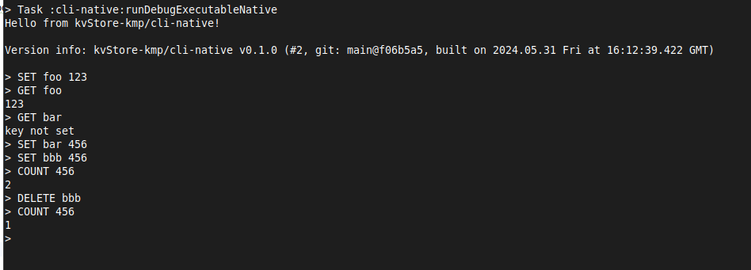
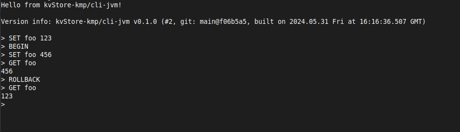
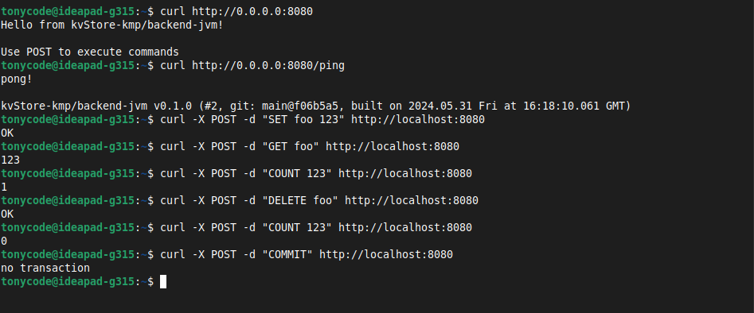
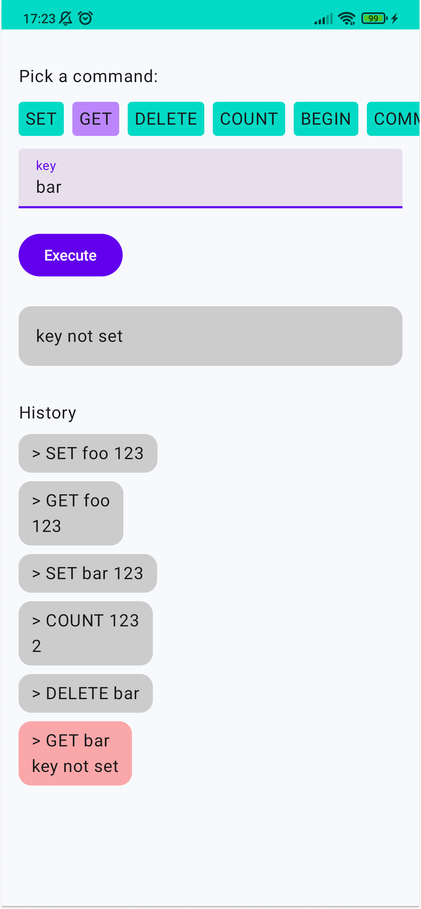
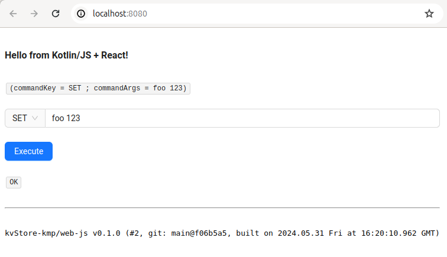

kvStore-kmp - key-value store with transactions support
=======================================================

KotlinMultiPlatform (KMP) library with interfaces for several platforms

NB: The main project's goal is a demonstration of KMP library development, artifacts aren't published yet


- interface: [TransactionalKeyValueStore](/kv-store/src/commonMain/kotlin/dev/tonycode/kvstore/TransactionalKeyValueStore.kt)
- not thread-safe impl based on Kotlin stdlib HashMap: [TransactionalKeyValueStoreImpl](/kv-store/src/commonMain/kotlin/dev/tonycode/kvstore/TransactionalKeyValueStoreImpl.kt)

commands:

- `SET key value`
- `GET key`
- `DELETE key`
- `COUNT value`
- transaction
    - `BEGIN`
    - `COMMIT`
    - `ROLLBACK`


## console `cli-native`

```shell
./gradlew cli-native:runDebugExecutableNative --console=plain
```

<a href="docs/screenshot-cli-native.png"></a>


## console `cli-jvm`

```shell
./gradlew cli-jvm:runInteractive --console=plain
```

<a href="docs/screenshot-cli-jvm.png"></a>


## `backend-jvm`

```shell
./gradlew backend-jvm:run
```

```shell
curl http://0.0.0.0:8080
curl http://0.0.0.0:8080/ping

curl -X POST -d "SET foo 123" http://localhost:8080
curl -X POST -d "GET foo" http://localhost:8080
curl -X POST -d "DELETE foo" http://localhost:8080
curl -X POST -d "COUNT 123" http://localhost:8080
curl -X POST -d "BEGIN" http://localhost:8080
curl -X POST -d "COMMIT" http://localhost:8080
curl -X POST -d "ROLLBACK" http://localhost:8080
```

<a href="docs/screenshot-backend-jvm.png"></a>


## `frontend-android`

```shell
# set proper AndroidSDK location in local.properties, e.g.:
# echo "sdk.dir=/home/user/Android/Sdk" > local.properties

./gradlew frontend-android:installDebug
```

<a href="docs/screenshot-frontend-android.png"></a>


## `frontend-web-js`

```shell
# after each dependencyUpdate
#./gradlew kotlinUpgradeYarnLock

./gradlew frontend-web-js:jsBrowserRun
```

### bundle distributable

- `./gradlew frontend-web:jsBrowserDistribution -Pprod=true` (production - no source-maps)
- see `frontend-web/build/dist/js/productionExecutable/*`

<a href="docs/screenshot-frontend-web-js.png"></a>
